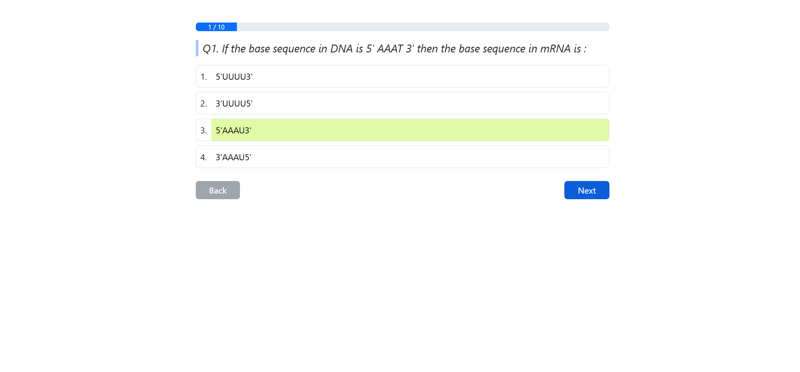
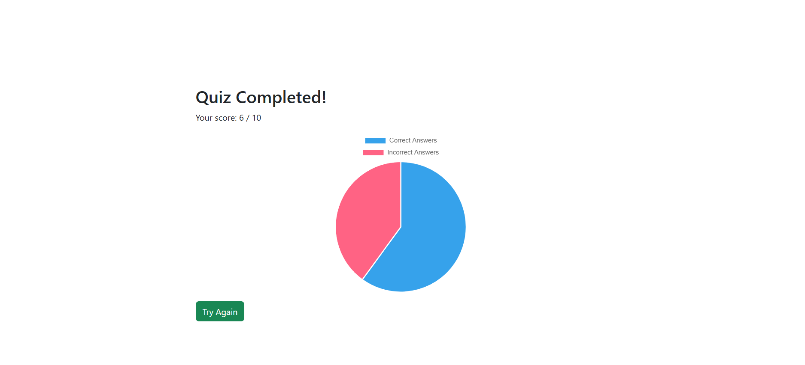

# Quiz App

A simple web-based quiz application built with React. This app fetches quiz questions from an API and allows users to answer multiple-choice questions. The app tracks the user's score and displays the final result upon completion.

## Features

- Fetches quiz questions from an API
- Interactive multiple-choice questions
- Score tracking and final result display
- User-friendly interface

## Technologies Used

- React
- Axios for API calls
- CSS for styling

## Installation

1. **Clone the repository:**

   ```bash
   git clone https://github.com/your-username/quiz-app.git
   cd quiz-app
   ```

2. **Install dependencies:**

   ```bash
   npm install
   ```

3. **Start the development server:**

   ```bash
   npm start
   ```

   The app will run at `http://localhost:3000`.

## Folder Structure

```
quiz-app/
├── src/
│   ├── App.js
│   ├── QuizComponent.js
│   ├── ResultComponent.js
│   └── index.js
├── public/
├── package.json
└── README.md
```

## API

Make sure to update the API endpoint in the `App.js` and `Quiz.js` files:

```javascript
axios.get('/Uw5CrX')
```

Replace `'/Uw5CrX'` with your actual API endpoint.

## Screenshots


## Video Demonstration

https://drive.google.com/file/d/1GVm_O7wQi5Qfr_yWgIIfV28hjPU8rGKT/view?usp=sharing


